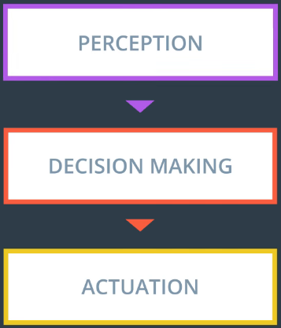

# Robotic Operating System

It is not operating system but more like software framewrok to simplify robot developement which can be installed in Docker or Linux (Ubuntu recommended) operating system.

## Motivation

Many components of robotic systems may researchers, engineers and practioneers built from sratch over and over because of that ROS idea was born. Instead of repeating those steps ROS tools and enviroment right away. Not to mention huge community with tons of code available.

## ROS Components

Robot may be Drone, Car, Robotics arm or other and they have similar basic architecture.

### 1. ROS Master

Contains all necesarry information of all active ROS nodes on system which allows other nodes to discover eachother as well as parameters (configuration parameters).

### 2. Nodes

Entites of ROS blocks which contains certain functionality.

### 3. Messages

ROS support different types of messages which could be send between nodes such as Physical Quantities (Positions, Velocities, Acceleartions, ..), Sensor Readings (Laser Scans, Images, Point Clouds, Measurements, ..).

Number of message types available are more than 200 but you can define your own message type if needed however it is recommended to search for already defined message types before defining your own.

### 4. Topics

Pub-Sub architecture.

Nodes can share messages with one another using Topics which is named bus e.g. /my_topic.

Node sending message to topic is called __Publishing___.
Node receiving message from topic is called __Subscribing__.

Messages are send directly from node to node without interracting with ROS Master.

### 5. Services

Request-Response architecture.

Similar to topics except can be called when needed instead of continuously publishing or subscribing to a topic which may result in less overhead.

Does not use publisher or subsriber like Topics but instead create service at a node by defining request and response.

## Compute Graph

Is a graph consisting of all Nodes, Services and Topics to represent systems architecture.

More info: http://wiki.ros.org/rqt_graph

## Setup ROS

There are many tutorials how to setup ROS so we will not go into details but rather point out some issues we had.

1. Don't give up on first failure. Keep trying and looking for an answer. It should workd but at the start it may be fustrating. We've all been there.
2. ROS using Python 2 by default and from our experience it should stay in that way. If you are using Python 3 then ROS may not run correctly as you must use Python 2 defind in System Paths. It's worth checing ~/.bashrc for that.
3. Virtual Machines are great but won't be able to GPUs so before creating Virtual Machine make sure you won't need GPU in future.
4. Rather than setting up individual environments for ROS use Git so environment for all would be same configure.

## Catkin workspace

### Catkin packages

ROS software is organized and distributed into packages, which are directories that might contain source code for ROS nodes, libraries, datasets, and more. Each package also contains a file with build instructions - the CMakeLists.txt file - and a package.xml file with information about the package. Packages enable ROS users to organize useful functionality in a convenient and reusable format.

### Catkin workspaces

A catkin workspace is a top-level directory where you build, install, and modify catkin packages. The workspace contains all of the packages for your project, along with several other directories for the catkin system to use when building executables and other targets from your source code.

