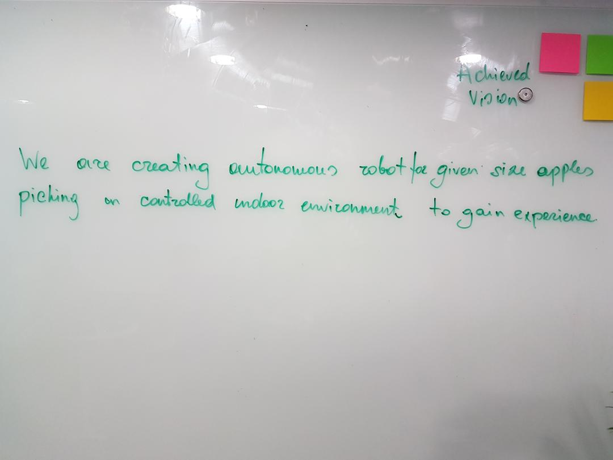
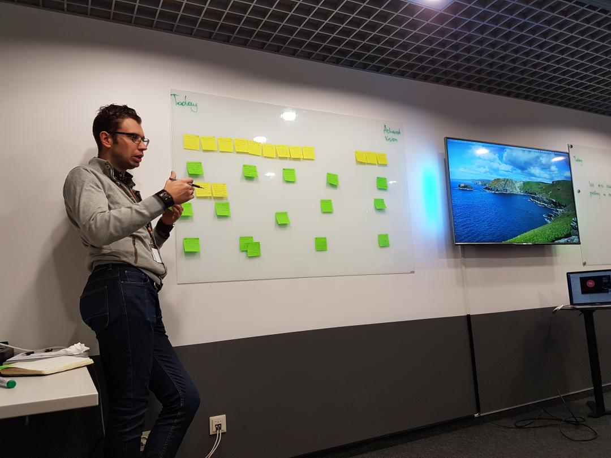

# 2017-09-05 15:20 Get similar views on Vision. Next real steps as team.

Vision : Creating autonomous robot for given size apples piching in controlled indoor environment to gain and share experience.

Introduction to ROS. Everyone get used to ROS and start working at architecture for our project.

