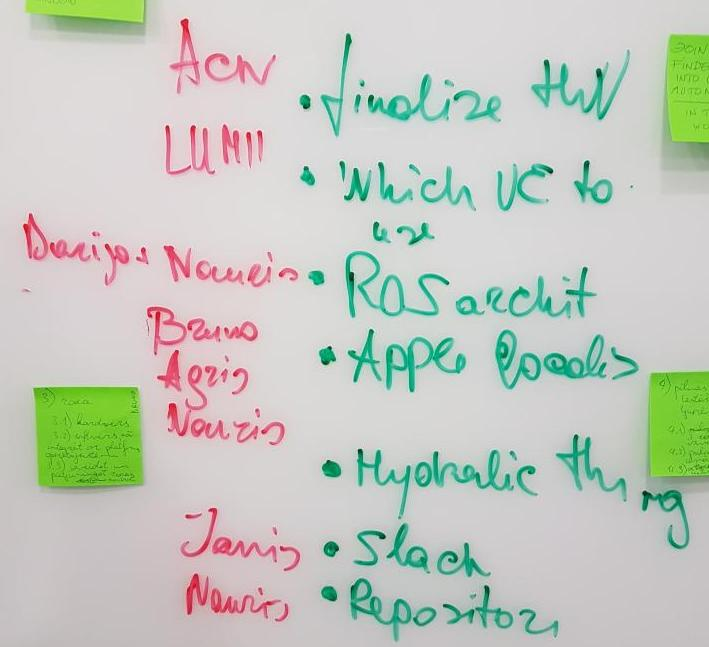

# 2017-09-05 15:20 Introduction with ROS. Backlog creation. First real results planned for next meeting.

* Nauris lecture about [project](https://github.com/Naurislv/Skycar-System-Integration) done in ROS
* Team discussions about first backlog 
* Decide who do what and plan first results and goals

