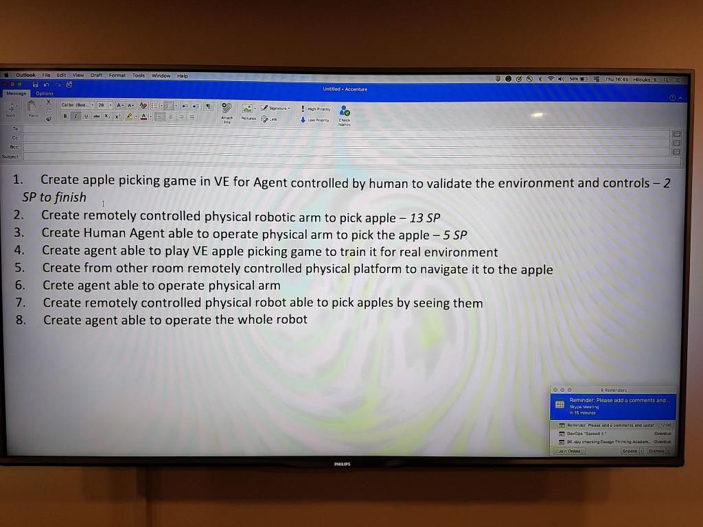

# 2017-12-14 15:10

* Nauris update repository with ROS code for web camera and TF object detection. Two new nodes. Tested and working.
* Gunars laser code. Busy with robotics contest.
* Vasyl introduction. New team member. Master degree 2000, later 2000s got PhD in computer science. Experience in with ML, NLP, Genetic Algorithms, architecture of CPUs. Java and Python, also C, C++. Rhapsody.
* Daria tested Gazebo 3v simulator for our case. Problem with connecting to Joystick.
* Agris review and edited laser pointer code to work in real time. Mostly busy other projects.
* Guntis presentation who's just back from NIPS.

Setup JIRA tasks and asked everyone to use it.

For first time we used Agile rating cards with which we were able to rate our tasks like team:
